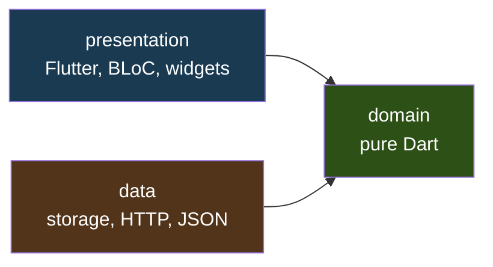
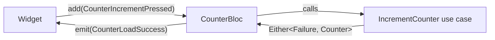

# BLoC + Clean Architecture — a guide to this project

A walkthrough of every layer in this repo, why each piece exists, and how to
change it. Every code sample is real code from `lib/`, not pseudocode.

**How to read this:** go top to bottom the first time. After that, jump to
[Part 9 — Recipes](#part-9--recipes-how-to-change-things) when you want to add
or change something.

---

## Table of contents

1. [Why bother](#part-1--why-bother)
2. [The one rule](#part-2--the-one-rule)
3. [Project map](#part-3--project-map)
4. [The domain layer](#part-4--the-domain-layer)
5. [The data layer](#part-5--the-data-layer)
6. [The presentation layer](#part-6--the-presentation-layer)
7. [Wiring it together with get_it](#part-7--wiring-it-together-with-get_it)
8. [Follow one tap all the way down](#part-8--follow-one-tap-all-the-way-down)
9. [Recipes: how to change things](#part-9--recipes-how-to-change-things)
10. [Testing each layer](#part-10--testing-each-layer)
11. [Mistakes that cost people days](#part-11--mistakes-that-cost-people-days)
12. [Cheat sheet](#part-12--cheat-sheet)
13. [References](#part-13--references)

---

## Part 1 — Why bother

Here is the counter this project replaced:

```dart
int _counter = 0;

void _incrementCounter() {
  setState(() { _counter++; });
}
```

Five lines. It works. So why did we turn it into eighteen files?

Honest answer: **for a counter, you should not.** This project is a practice
rig. The structure pays for itself at roughly five screens, a real backend, and
two people working on it — not at one screen. Learn the shape here where the
logic is trivial, so that when the logic is not trivial you already know where
everything goes.

What the structure actually buys you:

| Problem with the 5-line version | What the structure does about it |
|---|---|
| Business logic lives inside a widget, so testing it needs a widget test | Logic sits in plain Dart classes; tests run in milliseconds with no Flutter |
| Swapping storage means editing UI code | Swapping storage edits exactly one file |
| "Where do I put this?" has no answer | Every kind of code has exactly one home |
| Errors are `try/catch` scattered anywhere | Errors are values, handled at one boundary |

---

## Part 2 — The one rule

Clean architecture is mostly **one rule**, and everything else follows from it:

> **Dependencies point inward. Inner layers never know about outer layers.**



Read that diagram carefully — the arrows both point *at* domain. That means:

- `domain/` imports **nothing** from `data/` or `presentation/`
- `data/` imports `domain/` (it implements domain's contracts)
- `presentation/` imports `domain/` (it calls domain's use cases)
- `data/` and `presentation/` **never import each other**

### How to check you have not broken it

Open any file in `lib/features/counter/domain/` and look at the imports. If you
ever see `package:flutter/...`, `dio`, `shared_preferences`, or anything from
`data/` or `presentation/`, the rule is broken.

Try it now:

```bash
grep -rn "^import" lib/features/counter/domain/
```

You will only see `core/`, other `domain/` files, `equatable`, and `fpdart`.
Nothing else. That is the whole discipline.

### "But data implements a domain interface — isn't that a dependency?"

This is the part that confuses everyone, so it gets its own explanation.

`CounterRepository` is an **abstract class declared in `domain/`**. The concrete
`CounterRepositoryImpl` lives in `data/` and implements it.

```
domain/repositories/counter_repository.dart   <- abstract class (the contract)
                    ^
                    | implements
                    |
data/repositories/counter_repository_impl.dart <- concrete class
```

Domain says "I need something that can `getCounter()` and `saveCounter()`."
Data says "I can do that, here is how." Domain never learns the how. This is
called **dependency inversion** — the D in SOLID — and it is the mechanism that
lets the arrow point inward even though the real work happens outward.

---

## Part 3 — Project map

```
lib/
├── core/                                  shared across every feature
│   ├── error/
│   │   ├── exceptions.dart                CacheException   (thrown, data layer only)
│   │   └── failures.dart                  Failure, CacheFailure (returned, domain layer)
│   └── usecases/
│       └── usecase.dart                   UseCase<T, Params>, NoParams
│
├── features/
│   └── counter/                           one folder per feature
│       ├── domain/                        ── pure Dart, zero Flutter ──
│       │   ├── entities/counter.dart              the thing + its rules
│       │   ├── repositories/counter_repository.dart   the contract
│       │   └── usecases/
│       │       ├── get_counter.dart
│       │       ├── increment_counter.dart
│       │       ├── decrement_counter.dart
│       │       └── reset_counter.dart
│       │
│       ├── data/                          ── how it is really stored ──
│       │   ├── models/counter_model.dart          entity + serialization
│       │   ├── datasources/counter_local_data_source.dart
│       │   └── repositories/counter_repository_impl.dart
│       │
│       └── presentation/                  ── Flutter lives here ──
│           ├── bloc/
│           │   ├── counter_bloc.dart
│           │   ├── counter_event.dart
│           │   └── counter_state.dart
│           └── pages/counter_page.dart
│
├── injection_container.dart               get_it wiring
└── main.dart
```

**Feature-first, then layer.** Note the folder order: `features/counter/domain`,
not `domain/counter`. Everything about the counter sits in one folder, so you
can delete or move a whole feature without hunting through the project. This is
the layout most Flutter teams converge on.

---

## Part 4 — The domain layer

This is the layer that would survive rewriting the app in React Native. Three
kinds of thing live here.

### 4.1 The entity — data plus rules

`lib/features/counter/domain/entities/counter.dart`

```dart
class Counter extends Equatable {
  const Counter({required this.value});

  const Counter.initial() : value = 0;

  final int value;

  Counter increment() => Counter(value: value + 1);

  Counter decrement() => Counter(value: value - 1);

  @override
  List<Object?> get props => [value];
}
```

Four things to notice.

**1. It is immutable.** `value` is `final`. `increment()` does not change
`this` — it returns a brand new `Counter`. This matters more than it looks:

```dart
const original = Counter(value: 1);
original.increment();        // returns Counter(value: 2), thrown away
print(original.value);       // still 1
```

Immutability is what makes BLoC state comparison reliable. If states could
mutate, a widget could hold a reference to "the old state" that quietly became
the new state, and `==` would say they are equal when the UI has not rebuilt.

**2. The rule lives here, not in the repository.** `increment()` defines what
incrementing *means*. This is the single most important placement decision in
the project, so it gets its own section below.

**3. `Counter.initial()` is a named constructor** carrying the business fact
"counters start at zero." Better than scattering `Counter(value: 0)` around,
because if the rule changes to "start at 1" you edit one line.

**4. `extends Equatable` with `props`.** Without it, Dart compares by identity:

```dart
Counter(value: 5) == Counter(value: 5)   // false without Equatable!
```

With `props => [value]`, two counters holding the same number are equal.
Everything downstream depends on this — test assertions, BLoC's duplicate-state
skipping, `Set`/`Map` keys.

> ⚠️ **The Equatable footgun:** any field you leave out of `props` is invisible
> to `==`. Add a field to a class, forget to add it to `props`, and you get a
> bug where the UI silently refuses to rebuild because the new state "equals"
> the old one. Whenever you add a field, add it to `props` in the same edit.

### 4.2 Where do business rules live? (read this twice)

We could have designed the repository like this:

```dart
// ❌ What we did NOT do
abstract class CounterRepository {
  Future<Either<Failure, Counter>> increment();
  Future<Either<Failure, Counter>> decrement();
}
```

That looks simpler. It is also wrong, and here is why: the *implementation* of
`increment()` lives in `data/`. So the data layer would decide that incrementing
means adding 1. Your business rule is now buried in a storage class.

When the product manager says "gold members increment by 5," you would go
editing a file whose job is talking to a database.

What we actually did:

```dart
// ✅ What the repository is allowed to know
abstract class CounterRepository {
  Future<Either<Failure, Counter>> getCounter();
  Future<Either<Failure, Counter>> saveCounter(Counter counter);
}
```

The repository does **storage only**: read a thing, write a thing. The rule
lives on the entity. The use case orchestrates the two.

> 🧭 **The test:** if you can describe a method to a non-programmer
> stakeholder and they care about the answer ("what does increment mean?"),
> it is a business rule → entity or use case. If they would shrug ("how is it
> saved?"), it is a technical detail → data layer.

### 4.3 The repository interface — the contract

`lib/features/counter/domain/repositories/counter_repository.dart`

```dart
abstract class CounterRepository {
  Future<Either<Failure, Counter>> getCounter();

  Future<Either<Failure, Counter>> saveCounter(Counter counter);
}
```

Nine lines, no implementation. This file is the seam that makes everything else
testable — tests swap in a fake, production swaps in the real one, and the
domain layer cannot tell the difference.

Notice the return type: not `Future<Counter>` but
`Future<Either<Failure, Counter>>`. That deserves a detour.

### 4.4 `Either<Failure, T>` — errors as values

This comes from the `fpdart` package. `Either<L, R>` holds **either** a left
value **or** a right value, never both, never neither.

By convention: **Left = failure, Right = success.** (Mnemonic: "right" also
means correct.)

```dart
Either<Failure, Counter> ok  = right(const Counter(value: 3));
Either<Failure, Counter> bad = left(const CacheFailure('disk full'));
```

**Why not just throw?** Because the type system cannot see a `throw`:

```dart
// Compiles fine. Crashes in production. Nothing warned you.
Future<Counter> getCounter();
final counter = await repository.getCounter();
```

Versus:

```dart
// You literally cannot reach `counter` without deciding what happens on failure.
final result = await repository.getCounter();
result.fold(
  (failure) => /* you must handle this */,
  (counter) => /* only here do you have a Counter */,
);
```

`Either` turns "I hope somebody remembers to catch this" into a compiler-enforced
branch.

**`fold` is the main tool.** It takes two functions — one for each side — and
both must return the same type:

```dart
final String label = result.fold(
  (failure) => 'Error: ${failure.props}',   // runs if Left
  (counter) => 'Count: ${counter.value}',   // runs if Right
);
```

There is one wrinkle you will hit. When one branch is async and the other is
not, type inference gives up. Real code from `increment_counter.dart`:

```dart
return current.fold<Future<Either<Failure, Counter>>>(
  //         ^^^^^^^^^^^^^^^^^^^^^^^^^^^^^^^^ tell fold the return type
  (failure) async => left<Failure, Counter>(failure),
  //        ^^^^^ make the non-async branch async so both match
  (counter) => repository.saveCounter(counter.increment()),
);
```

Without the explicit `<Future<Either<Failure, Counter>>>`, Dart infers the
common supertype of `Either` and `Future<Either>` — which is `Object` — and the
code stops compiling. Remember this pattern; it is the one rough edge of using
`Either` with async code.

### 4.5 Use cases — one per user action

`lib/core/usecases/usecase.dart` defines the shared contract:

```dart
abstract class UseCase<T, Params> {
  Future<Either<Failure, T>> call(Params params);
}

class NoParams extends Equatable {
  const NoParams();

  @override
  List<Object?> get props => [];
}
```

**Why the method is named `call`:** in Dart, an object with a `call` method can
be invoked like a function. So instead of `incrementCounter.execute()` you write:

```dart
await incrementCounter(const NoParams());
```

**Why `NoParams` exists:** the base class needs *some* type for `Params`.
Using `void` or `null` makes the generics awkward, so a tiny empty class keeps
every use case the same shape. Uniform shape means DI and tests treat them all
identically.

Now the simplest use case — a pure pass-through:

```dart
class GetCounter implements UseCase<Counter, NoParams> {
  const GetCounter(this.repository);

  final CounterRepository repository;

  @override
  Future<Either<Failure, Counter>> call(NoParams params) {
    return repository.getCounter();
  }
}
```

> 🤔 **"This use case does nothing. Why does it exist?"**
> A fair question, and the answer is honest: today it adds no logic. It earns
> its place by being *the place where logic will go*. When you add "log an
> analytics event on load" or "refresh from the server if the cache is older
> than an hour," it goes here — and the BLoC does not change. It also keeps
> one uniform way to call into the domain, so the BLoC never has to know that
> some actions go through use cases and some through repositories.

And the interesting one — read, apply rule, write:

```dart
class IncrementCounter implements UseCase<Counter, NoParams> {
  const IncrementCounter(this.repository);

  final CounterRepository repository;

  @override
  Future<Either<Failure, Counter>> call(NoParams params) async {
    final current = await repository.getCounter();

    return current.fold<Future<Either<Failure, Counter>>>(
      (failure) async => left<Failure, Counter>(failure),
      (counter) => repository.saveCounter(counter.increment()),
    );
  }
}
```

In English: read the counter. If the read failed, pass that failure straight up
without writing anything. If it succeeded, ask the entity to apply the rule,
then save the result.

`ResetCounter` is the odd one out, and for a good reason:

```dart
@override
Future<Either<Failure, Counter>> call(NoParams params) {
  return repository.saveCounter(const Counter.initial());
}
```

No read first — reset does not depend on the current value, so reading would be
a pointless round trip. The tests assert this explicitly with
`verifyNever(() => mockRepository.getCounter())`. Small thing, but it shows the
tests are describing intent, not just covering lines.

---

## Part 5 — The data layer

Domain said what it needs. Data provides it.

### 5.1 Model vs Entity — why two classes for one idea

`lib/features/counter/data/models/counter_model.dart`

```dart
class CounterModel extends Counter {
  const CounterModel({required super.value});

  factory CounterModel.fromJson(Map<String, dynamic> json) {
    return CounterModel(value: json['value'] as int);
  }

  factory CounterModel.fromEntity(Counter counter) {
    return CounterModel(value: counter.value);
  }

  Map<String, dynamic> toJson() => {'value': value};
}
```

The model is the entity **plus serialization**. Why keep them separate?

Because your API will eventually return this:

```json
{ "counter_value": 3, "last_modified_utc": "2026-09-23T10:00:00Z", "_v": 2 }
```

Snake case, a timestamp nobody in the domain cares about, an internal version
field. If your entity were also your JSON class, all that backend noise would
leak into your business logic — and the day the backend renames a field, your
domain layer changes.

With the split: the model absorbs the mess, the entity stays clean.

**Why `extends` and not a separate class with a mapper?** Because
`CounterModel` *is a* `Counter`, the repository can return a model wherever a
`Counter` is expected, with no conversion code:

```dart
final CounterModel model = await localDataSource.getCounter();
return right<Failure, Counter>(model);   // no mapping needed
```

You will see teams use composition plus explicit `toEntity()` mappers instead.
Both work. Inheritance is less code; composition is stricter. This project uses
inheritance.

### 5.2 The data source — the only class that touches storage

`lib/features/counter/data/datasources/counter_local_data_source.dart`

```dart
abstract class CounterLocalDataSource {
  Future<CounterModel> getCounter();

  Future<CounterModel> cacheCounter(CounterModel counter);
}

class InMemoryCounterLocalDataSource implements CounterLocalDataSource {
  CounterModel? _cached;

  @override
  Future<CounterModel> getCounter() async {
    return _cached ??= const CounterModel(value: 0);
  }

  @override
  Future<CounterModel> cacheCounter(CounterModel counter) async {
    _cached = counter;
    return counter;
  }
}
```

Note that data sources **throw** (`CacheException`) rather than returning
`Either`. That is deliberate: throwing is the natural Dart idiom at this level,
and there is exactly one place responsible for converting — the repository.

> The abstract class is here for the same reason as the repository interface:
> so `CounterRepositoryImpl` can be unit-tested against a mock data source,
> and so you can swap in `SharedPreferencesCounterDataSource` later without
> touching anything above.

### 5.3 The repository implementation — where exceptions become failures

`lib/features/counter/data/repositories/counter_repository_impl.dart`

```dart
class CounterRepositoryImpl implements CounterRepository {
  const CounterRepositoryImpl({required this.localDataSource});

  final CounterLocalDataSource localDataSource;

  @override
  Future<Either<Failure, Counter>> getCounter() async {
    try {
      final counter = await localDataSource.getCounter();
      return right<Failure, Counter>(counter);
    } on CacheException catch (e) {
      return left<Failure, Counter>(CacheFailure(e.message));
    }
  }

  @override
  Future<Either<Failure, Counter>> saveCounter(Counter counter) async {
    try {
      final saved = await localDataSource.cacheCounter(
        CounterModel.fromEntity(counter),
      );
      return right<Failure, Counter>(saved);
    } on CacheException catch (e) {
      return left<Failure, Counter>(CacheFailure(e.message));
    }
  }
}
```

**This is the most important file in the data layer.** It is the border post:

```
        data layer                    │         domain & presentation
   things THROW exceptions            │        things RETURN failures
                                      │
  localDataSource.getCounter() ──────►│
        throws CacheException         │
                                      │
                    try/catch ────────┼──────► Left(CacheFailure(...))
                                      │
```

Everything below the line uses exceptions. Everything above uses values. One
file does the translation. That is why this is the only `try/catch` in the
entire feature — and if you ever find yourself writing `try/catch` in a BLoC,
you have skipped this boundary.

### 5.4 Exception vs Failure — why both exist

| | `CacheException` | `CacheFailure` |
|---|---|---|
| Defined in | `core/error/exceptions.dart` | `core/error/failures.dart` |
| Mechanism | `throw` | returned inside `Left` |
| Lives in | data layer only | domain + presentation |
| Can be ignored? | yes, silently | no, the type forces a branch |
| Equatable? | no | yes — so tests can compare them |

They usually come in pairs: `ServerException`/`ServerFailure`,
`CacheException`/`CacheFailure`, and so on.

---

## Part 6 — The presentation layer

### 6.1 What BLoC actually is

Strip away the vocabulary and BLoC is one function:

```
  events in  ──►  [ BLoC ]  ──►  states out
```

It is a stream transformer. You push events into it; it pushes states out. The
UI only ever does two things: dispatch events, and rebuild from states.



**Events are things that happened. States are what to show.** That distinction
sounds pedantic until you get it wrong — see the naming section below.

### 6.2 Events

`lib/features/counter/presentation/bloc/counter_event.dart`

```dart
part of 'counter_bloc.dart';

abstract class CounterEvent extends Equatable {
  const CounterEvent();

  @override
  List<Object?> get props => [];
}

class CounterStarted extends CounterEvent {
  const CounterStarted();
}

class CounterIncrementPressed extends CounterEvent {
  const CounterIncrementPressed();
}

class CounterDecrementPressed extends CounterEvent {
  const CounterDecrementPressed();
}

class CounterResetPressed extends CounterEvent {
  const CounterResetPressed();
}
```

**Naming matters more than you would think.** The official convention is
`BlocSubject` + `Noun` + `Verb (past tense)`:

- ✅ `CounterIncrementPressed` — describes what the *user did*
- ❌ `IncrementCounter` — describes what the *bloc should do*

Why the fuss? Because an event named `IncrementCounter` is a command, and
commands assume one handler doing one thing. `CounterIncrementPressed` is a
fact, and facts can be reacted to in several ways — increment the counter, log
analytics, show a tooltip after the third press. Naming events as facts keeps
that door open.

**What is `part of`?** These three files (`_bloc`, `_event`, `_state`) are one
Dart library split across files. `part`/`part of` lets them see each other's
private members without exporting anything. The `bloc` VS Code extension
generates this layout by default, and it is why you import only
`counter_bloc.dart` to get all three.

### 6.3 States

`lib/features/counter/presentation/bloc/counter_state.dart`

```dart
abstract class CounterState extends Equatable {
  const CounterState();

  @override
  List<Object?> get props => [];
}

class CounterInitial extends CounterState {
  const CounterInitial();
}

class CounterLoadInProgress extends CounterState {
  const CounterLoadInProgress();
}

class CounterLoadSuccess extends CounterState {
  const CounterLoadSuccess(this.counter);

  final Counter counter;

  @override
  List<Object?> get props => [counter];
}

class CounterLoadFailure extends CounterState {
  const CounterLoadFailure(this.message);

  final String message;

  @override
  List<Object?> get props => [message];
}
```

Convention: `Initial` / `InProgress` / `Success` / `Failure`.

**Equatable is load-bearing here.** `Bloc.emit` skips a state that `==` the
current one:

```dart
// inside package:bloc
if (state == newState && _emitted) return;
```

So emitting `CounterLoadSuccess(Counter(value: 3))` twice in a row causes one
rebuild, not two. Drop Equatable and every emit is "new," and your whole UI
rebuilds on every tick.

### 6.4 The BLoC

`lib/features/counter/presentation/bloc/counter_bloc.dart`

```dart
class CounterBloc extends Bloc<CounterEvent, CounterState> {
  CounterBloc({
    required this.getCounter,
    required this.incrementCounter,
    required this.decrementCounter,
    required this.resetCounter,
  }) : super(const CounterInitial()) {
    on<CounterStarted>(_onStarted);

    on<CounterIncrementPressed>(_onIncrementPressed, transformer: sequential());
    on<CounterDecrementPressed>(_onDecrementPressed, transformer: sequential());
    on<CounterResetPressed>(_onResetPressed, transformer: sequential());
  }

  final GetCounter getCounter;
  final IncrementCounter incrementCounter;
  final DecrementCounter decrementCounter;
  final ResetCounter resetCounter;
  // ...
}
```

**The dependencies are use cases, never the repository.** This is the rule that
keeps the domain layer from being bypassed. A BLoC that imports
`CounterRepository` has quietly deleted your domain layer.

Every handler has the same shape, so it lives in one helper:

```dart
Future<void> _runUseCase(
  Future<Either<Failure, Counter>> Function() action,
  Emitter<CounterState> emit,
) async {
  emit(const CounterLoadInProgress());

  final result = await action();

  emit(
    result.fold(
      (failure) => CounterLoadFailure(_messageFor(failure)),
      (counter) => CounterLoadSuccess(counter),
    ),
  );
}
```

Announce work → run the use case → map the result onto a state. Every handler
is then one line:

```dart
Future<void> _onIncrementPressed(
  CounterIncrementPressed event,
  Emitter<CounterState> emit,
) {
  return _runUseCase(() => incrementCounter(const NoParams()), emit);
}
```

And failure-to-text mapping stays in presentation, where it belongs:

```dart
String _messageFor(Failure failure) {
  return switch (failure) {
    CacheFailure(:final message) => message,
    _ => _unexpectedFailureMessage,
  };
}
```

> 🌍 **Why the domain layer carries no user-facing strings:** the day you add
> a second language, you want one place to translate. If `CacheFailure` held
> `'Could not reach local storage'` *as the thing shown to users*, translation
> would mean editing domain code. Keeping the wording in presentation means
> swapping `_messageFor` for a localization lookup and nothing else moves.

### 6.5 `sequential()` — a real bug this prevents

This is worth understanding properly, because it is a genuine concurrency bug
hiding in three innocent-looking lines.

`IncrementCounter` is a **read-modify-write**. By default, `on<Event>` handlers
run **concurrently**. So two fast taps interleave like this:

```
  time ──►
  tap 1:  read(0) ──────────── write(1)
  tap 2:      read(0) ──────────── write(1)
                  ▲                    ▲
            both read 0          final value: 1
                                 one tap was LOST
```

With `transformer: sequential()`, the second handler waits:

```
  tap 1:  read(0) ── write(1)
  tap 2:                       read(1) ── write(2)
                                              ▲
                                        final value: 2  ✅
```

The available transformers, from `package:bloc_concurrency`:

| Transformer | Behavior | Use for |
|---|---|---|
| `concurrent()` | all at once (the default) | independent reads |
| `sequential()` | queue, one at a time | read-modify-write, ordered writes |
| `droppable()` | ignore new events while busy | submit buttons, preventing double-send |
| `restartable()` | cancel the previous, start the new | search-as-you-type |

There is a test in this repo that proves the bug is real —
`'runs rapid increments one at a time instead of concurrently'` in
[`counter_bloc_test.dart`](../test/features/counter/presentation/bloc/counter_bloc_test.dart).
Comment out `transformer: sequential()` in the bloc and run it; it fails.
That is worth doing once with your own hands.

### 6.6 The UI

`lib/features/counter/presentation/pages/counter_page.dart`

**Page vs View split:**

```dart
class CounterPage extends StatelessWidget {
  const CounterPage({super.key});

  @override
  Widget build(BuildContext context) {
    return BlocProvider(
      create: (_) => sl<CounterBloc>()..add(const CounterStarted()),
      child: const CounterView(),
    );
  }
}
```

`CounterPage` only creates and provides the bloc. `CounterView` only consumes
it. The payoff is testability: a widget test can wrap `CounterView` in a
`BlocProvider` holding a *mock* bloc, with no service locator and no real use
cases.

The `..add(const CounterStarted())` is Dart's cascade operator — create the
bloc, immediately fire the startup event, and still return the bloc.

**`BlocConsumer` = builder + listener:**

```dart
BlocConsumer<CounterBloc, CounterState>(
  listener: (context, state) {
    if (state is CounterLoadFailure) {
      ScaffoldMessenger.of(context)
        ..hideCurrentSnackBar()
        ..showSnackBar(SnackBar(content: Text(state.message)));
    }
  },
  builder: (context, state) {
    return switch (state) {
      CounterLoadSuccess(:final counter) =>
        Text('${counter.value}', style: theme.textTheme.displayLarge),
      CounterLoadFailure(:final message) => Text(message),
      _ => const SizedBox.square(
          dimension: 48,
          child: CircularProgressIndicator(),
        ),
    };
  },
)
```

> ⚠️ **Never show a SnackBar, dialog, or navigation from `builder`.** `builder`
> can run many times for one state — on hot reload, on parent rebuild, on
> theme change — and you would get a stack of duplicate SnackBars. `listener`
> runs **once per state change**. Rule of thumb: if it draws pixels in the
> tree, `builder`; if it *does* something, `listener`.

**Which widget to reach for:**

| Widget | Use when |
|---|---|
| `BlocBuilder` | you only need to rebuild UI |
| `BlocListener` | you only need side effects (snackbar, navigation, dialog) |
| `BlocConsumer` | you need both |
| `BlocProvider` | you are creating/providing the bloc |
| `BlocSelector` | you want to rebuild on *one field* of the state only |

**`context.read` vs `context.watch`:**

```dart
final bloc = context.read<CounterBloc>();   // get it, do NOT rebuild on change
```

`read` in callbacks and one-off lookups. `watch` subscribes and rebuilds — in a
`build` method only, and usually `BlocBuilder` is the better tool anyway.
Calling `watch` inside an `onPressed` throws.

Also note `heroTag` on the three `FloatingActionButton`s. Two unlabelled FABs on
one screen crash with a hero tag collision. Classic five-minute bug.

---

## Part 7 — Wiring it together with get_it

Every class in this project takes its dependencies through its constructor and
never constructs them itself. Something has to actually build the object graph.
That is `lib/injection_container.dart`.

```dart
final sl = GetIt.instance;   // "sl" = service locator, the usual name

Future<void> init() async {
  _initCounter();
}

void _initCounter() {
  // Bloc — factory
  sl.registerFactory(
    () => CounterBloc(
      getCounter: sl(),
      incrementCounter: sl(),
      decrementCounter: sl(),
      resetCounter: sl(),
    ),
  );

  // Use cases — lazy singletons
  sl.registerLazySingleton(() => GetCounter(sl()));
  sl.registerLazySingleton(() => IncrementCounter(sl()));
  sl.registerLazySingleton(() => DecrementCounter(sl()));
  sl.registerLazySingleton(() => ResetCounter(sl()));

  // Repository — registered under the DOMAIN interface
  sl.registerLazySingleton<CounterRepository>(
    () => CounterRepositoryImpl(localDataSource: sl()),
  );

  // Data source — must be a singleton
  sl.registerLazySingleton<CounterLocalDataSource>(
    InMemoryCounterLocalDataSource.new,
  );
}
```

**`sl()` with no type argument** works because Dart infers the type from the
parameter it is being passed to. `getCounter: sl()` resolves `sl<GetCounter>()`.

### Choosing factory vs singleton

| Registration | Creates | Use for |
|---|---|---|
| `registerFactory` | a **new** instance every call | **BLoCs** — they hold state and get `close()`d with the widget |
| `registerLazySingleton` | one instance, built on first use | use cases, repositories, data sources |
| `registerSingleton` | one instance, built immediately | things needing async setup before `runApp` |

Two things here will bite you if you get them backwards:

> 🔴 **The BLoC must be a factory.** Blocs are closed when their widget is
> disposed. Register one as a singleton, navigate away and back, and you get
> `Bad state: Cannot add new events after calling close`.

> 🔴 **The data source must be a singleton.** In this project the in-memory
> data source *is* the storage. Register it as a factory and every call gets a
> fresh empty instance — the counter would read 0 forever and your increments
> would vanish. Try it if you want to see a confusing bug.

**Note the `<CounterRepository>` type argument** on the repository
registration. Without it, get_it registers under `CounterRepositoryImpl`, and
`sl<CounterRepository>()` throws at runtime. Always register against the
interface.

And in `main.dart`:

```dart
Future<void> main() async {
  WidgetsFlutterBinding.ensureInitialized();
  await di.init();
  runApp(const MyApp());
}
```

`ensureInitialized()` is required because `di.init()` runs before `runApp` and
may need platform channels (it will, once you add SharedPreferences).

---

## Part 8 — Follow one tap all the way down

Everything above, in one trace. User taps **+**:

```
 1. FloatingActionButton.onPressed
       bloc.add(const CounterIncrementPressed())          presentation
                    │
 2. CounterBloc._onIncrementPressed                        presentation
       emit(CounterLoadInProgress())        ──► UI shows spinner
                    │
 3. incrementCounter(const NoParams())                     domain (use case)
                    │
 4.    repository.getCounter()                             domain interface
                    │
 5.        CounterRepositoryImpl.getCounter()              data
             try {  localDataSource.getCounter()  }        data
             returns Right(CounterModel(value: 3))
                    │
 6.    counter.increment()  ──► Counter(value: 4)          domain ENTITY (rule)
                    │
 7.    repository.saveCounter(Counter(value: 4))           domain interface
                    │
 8.        CounterRepositoryImpl.saveCounter()             data
             CounterModel.fromEntity(...)
             localDataSource.cacheCounter(...)
             returns Right(CounterModel(value: 4))
                    │
 9. back in the bloc: result.fold(...)                     presentation
       emit(CounterLoadSuccess(Counter(value: 4)))
                    │
10. BlocConsumer.builder rebuilds ──► Text('4')            presentation
```

Read down the right-hand column: `presentation → domain → data → domain →
presentation`. Control passes outward and back, but **every arrow of
*dependency* points inward**. The data layer never calls up into presentation;
it just returns.

And the failure path, step 5:

```
 5'.       localDataSource throws CacheException('disk full')
             caught by CounterRepositoryImpl
             returns Left(CacheFailure('disk full'))
 6'.   use case short-circuits: no save attempted
 9'.   bloc: result.fold(...) ──► emit(CounterLoadFailure('disk full'))
10'.   listener shows SnackBar; builder shows the message
```

No `try/catch` anywhere above step 5. The failure travelled as a value.

---

## Part 9 — Recipes: how to change things

### 9.1 Add a business rule ("increment by 5")

Only one file changes.

```dart
// domain/entities/counter.dart
Counter increment({int by = 1}) => Counter(value: value + by);
```

The rule is on the entity, so the use case, repository, data source, bloc, and
UI all stay as they are. This is the payoff for the placement decision in
Part 4.2.

### 9.2 Add a rule that needs a parameter from the UI

Say the user picks a step size. Now `NoParams` is not enough.

**1.** Define params in the use case file:

```dart
class IncrementParams extends Equatable {
  const IncrementParams({required this.by});

  final int by;

  @override
  List<Object?> get props => [by];
}

class IncrementCounter implements UseCase<Counter, IncrementParams> {
  // ...
  @override
  Future<Either<Failure, Counter>> call(IncrementParams params) async {
    final current = await repository.getCounter();
    return current.fold<Future<Either<Failure, Counter>>>(
      (failure) async => left<Failure, Counter>(failure),
      (counter) => repository.saveCounter(counter.increment(by: params.by)),
    );
  }
}
```

**2.** Carry it on the event:

```dart
class CounterIncrementPressed extends CounterEvent {
  const CounterIncrementPressed({this.by = 1});

  final int by;

  @override
  List<Object?> get props => [by];
}
```

**3.** Pass it through in the handler:

```dart
return _runUseCase(() => incrementCounter(IncrementParams(by: event.by)), emit);
```

**4.** Dispatch it: `bloc.add(const CounterIncrementPressed(by: 5))`

Note what did *not* change: the repository, the data source, the model. Params
flow along the same path the architecture already laid out.

### 9.3 Make the counter survive app restart

This is the demo of why the layering was worth it.

**1.** `flutter pub add shared_preferences`

**2.** Add one new class to the data source file — the existing abstract class
is unchanged:

```dart
class SharedPrefsCounterDataSource implements CounterLocalDataSource {
  const SharedPrefsCounterDataSource(this.prefs);

  static const _key = 'CACHED_COUNTER';

  final SharedPreferences prefs;

  @override
  Future<CounterModel> getCounter() async {
    final raw = prefs.getString(_key);
    if (raw == null) return const CounterModel(value: 0);
    try {
      return CounterModel.fromJson(
        json.decode(raw) as Map<String, dynamic>,
      );
    } on FormatException {
      throw const CacheException('Stored counter is corrupt');
    }
  }

  @override
  Future<CounterModel> cacheCounter(CounterModel counter) async {
    final ok = await prefs.setString(_key, json.encode(counter.toJson()));
    if (!ok) throw const CacheException('Could not write counter');
    return counter;
  }
}
```

Now `toJson`/`fromJson` on the model finally earn their keep.

**3.** Swap the registration in `injection_container.dart`:

```dart
Future<void> init() async {
  final prefs = await SharedPreferences.getInstance();
  sl.registerLazySingleton(() => prefs);
  _initCounter();
}

// and replace the data source line:
sl.registerLazySingleton<CounterLocalDataSource>(
  () => SharedPrefsCounterDataSource(sl()),
);
```

**Files changed: two.** The entity, all four use cases, the repository
implementation, the bloc, and the entire UI are untouched — and every existing
test still passes, because none of them knew how storage worked.

That is the whole argument for clean architecture, demonstrated.

### 9.4 Add a whole new feature

Copy the shape:

```
lib/features/<name>/
├── domain/
│   ├── entities/<name>.dart
│   ├── repositories/<name>_repository.dart
│   └── usecases/<verb>_<name>.dart
├── data/
│   ├── models/<name>_model.dart
│   ├── datasources/<name>_remote_data_source.dart
│   └── repositories/<name>_repository_impl.dart
└── presentation/
    ├── bloc/<name>_bloc.dart  (+ _event, _state)
    └── pages/<name>_page.dart
```

Then add a `_init<Name>()` function in `injection_container.dart` and call it
from `init()`.

**Build order that works: domain → data → presentation.** Start with the
entity and the repository interface, because they define the vocabulary
everything else speaks. Starting from the UI leads to entities shaped like
widgets.

For a feature with a remote API you would also add:

```dart
// core/error/exceptions.dart
class ServerException implements Exception { /* ... */ }

// core/error/failures.dart
class ServerFailure extends Failure { /* ... */ }
```

and the repository implementation would check connectivity
(`connectivity_plus` is already in `pubspec.yaml`) to decide between remote and
cached data.

### 9.5 Fix the spinner flash

Right now `_runUseCase` emits `CounterLoadInProgress` on every tap, so with slow
storage the number would disappear behind a spinner on each press. The standard
fix is a **single state class with a status field**, so the value survives
across status changes:

```dart
enum CounterStatus { initial, loading, success, failure }

class CounterState extends Equatable {
  const CounterState({
    this.status = CounterStatus.initial,
    this.counter = const Counter.initial(),
    this.message = '',
  });

  final CounterStatus status;
  final Counter counter;      // ← survives a loading state
  final String message;

  CounterState copyWith({
    CounterStatus? status,
    Counter? counter,
    String? message,
  }) {
    return CounterState(
      status: status ?? this.status,
      counter: counter ?? this.counter,
      message: message ?? this.message,
    );
  }

  @override
  List<Object?> get props => [status, counter, message];
}
```

The UI then shows `state.counter.value` always, and overlays a small spinner
when `state.status == CounterStatus.loading`.

**Trade-off, honestly stated:** sealed subclasses (what this project uses) give
you exhaustive `switch` and make illegal states unrepresentable — you cannot
have a "success with no data." A single class with a status enum is friendlier
when the UI needs to keep showing old data during a refresh, but lets you
construct nonsense like `status: failure` with a stale counter. Most production
apps end up with the status-field version for exactly the flash reason. Start
with subclasses while learning; switch when the flash annoys you.

---

## Part 10 — Testing each layer

Each layer is tested against **mocks of the layer below**. That is only possible
because every dependency is an abstract class injected through a constructor.

```
 counter_bloc_test.dart              mocks the 4 use cases
 increment_counter_test.dart         mocks CounterRepository
 counter_repository_impl_test.dart   mocks CounterLocalDataSource
 counter_test.dart                   mocks nothing — pure logic
```

Run everything: `flutter test` — 24 tests, about a second, no emulator.

### 10.1 Entity tests need no mocks at all

```dart
test('increment returns a counter one higher', () {
  expect(const Counter(value: 1).increment(), const Counter(value: 2));
});

test('increment leaves the original untouched', () {
  const original = Counter(value: 1);
  original.increment();
  expect(original.value, 1);      // immutability, asserted
});
```

Pure functions, instant, no setup. This is what putting rules on entities buys
you.

### 10.2 Use case tests mock the repository

```dart
class MockCounterRepository extends Mock implements CounterRepository {}

void main() {
  late IncrementCounter usecase;
  late MockCounterRepository mockRepository;

  setUpAll(() => registerFallbackValue(const Counter.initial()));

  setUp(() {
    mockRepository = MockCounterRepository();
    usecase = IncrementCounter(mockRepository);
  });

  test('saves the current counter incremented by one', () async {
    // arrange
    when(() => mockRepository.getCounter())
        .thenAnswer((_) async => right(const Counter(value: 1)));
    when(() => mockRepository.saveCounter(any()))
        .thenAnswer((_) async => right(const Counter(value: 2)));

    // act
    final result = await usecase(const NoParams());

    // assert
    expect(result, right(const Counter(value: 2)));
    verify(() => mockRepository.saveCounter(const Counter(value: 2))).called(1);
    verifyNoMoreInteractions(mockRepository);
  });
}
```

**arrange / act / assert** — keep the comments, they make tests skimmable.

The failure case is just as important, and asserts a *behaviour*, not just a
return value:

```dart
test('returns the failure and does not save when the read fails', () async {
  when(() => mockRepository.getCounter())
      .thenAnswer((_) async => left(const CacheFailure()));

  final result = await usecase(const NoParams());

  expect(result, left(const CacheFailure()));
  verifyNever(() => mockRepository.saveCounter(any()));   // ← the real assertion
});
```

### 10.3 mocktail essentials

This project uses `mocktail` rather than `mockito`, because it needs no
`build_runner` codegen — you just write the mock class and go.

```dart
class MockThing extends Mock implements Thing {}
```

| Task | Syntax |
|---|---|
| Stub a value | `when(() => mock.foo()).thenReturn(x)` |
| Stub a Future | `when(() => mock.foo()).thenAnswer((_) async => x)` |
| Stub a throw | `when(() => mock.foo()).thenThrow(MyException())` |
| Match any arg | `any()` |
| Assert a call | `verify(() => mock.foo(arg)).called(1)` |
| Assert no call | `verifyNever(() => mock.foo(any()))` |
| Assert nothing else | `verifyNoMoreInteractions(mock)` |

Two gotchas worth memorising:

> **Everything goes in a closure.** `when(() => ...)`, `verify(() => ...)`.
> Forget the `() =>` and you call the real method instead of intercepting it.

> **`any()` with a custom type needs `registerFallbackValue` first.**
> ```dart
> setUpAll(() => registerFallbackValue(const Counter.initial()));
> ```
> Without it you get `Bad state: A test tried to use any ... without
> registering a fallback value`. Built-in types like `int` and `String` work
> without it.

**`thenReturn` vs `thenAnswer`:** `thenReturn` computes the value once, up
front. `thenAnswer` runs your function on every call. Futures need
`thenAnswer` — otherwise you hand out the same already-completed Future to
every caller.

### 10.4 Bloc tests with `bloc_test`

```dart
blocTest<CounterBloc, CounterState>(
  'emits [InProgress, Success] on CounterIncrementPressed',
  setUp: () {
    when(() => mockIncrementCounter(any()))
        .thenAnswer((_) async => right(const Counter(value: 4)));
  },
  build: buildBloc,
  act: (bloc) => bloc.add(const CounterIncrementPressed()),
  expect: () => const [
    CounterLoadInProgress(),
    CounterLoadSuccess(Counter(value: 4)),
  ],
  verify: (_) => verify(() => mockIncrementCounter(const NoParams())).called(1),
);
```

The fields, in the order they run: `setUp` → `build` → `seed` → `act` →
`wait` → `expect` → `verify`.

`expect` lists the states emitted **after** the initial one. The initial state
is asserted separately:

```dart
test('initial state is CounterInitial', () {
  expect(buildBloc().state, const CounterInitial());
});
```

### 10.5 A test that proves the concurrency fix

This one is worth studying, because it shows a test asserting something
genuinely subtle:

```dart
blocTest<CounterBloc, CounterState>(
  'runs rapid increments one at a time instead of concurrently',
  setUp: () {
    var value = 0;
    when(() => mockIncrementCounter(any())).thenAnswer((_) async {
      await Future<void>.delayed(const Duration(milliseconds: 10));
      return right(Counter(value: ++value));
    });
  },
  build: buildBloc,
  act: (bloc) => bloc
    ..add(const CounterIncrementPressed())
    ..add(const CounterIncrementPressed()),
  expect: () => const [
    CounterLoadInProgress(),
    CounterLoadSuccess(Counter(value: 1)),
    CounterLoadInProgress(),      // ← the load-bearing line
    CounterLoadSuccess(Counter(value: 2)),
  ],
);
```

Why that second `CounterLoadInProgress` proves it: with `concurrent()`, both
handlers start immediately and both emit `CounterLoadInProgress` back to back —
but `Bloc.emit` **skips a state equal to the current one**, so the second is
swallowed and you observe only three states. With `sequential()`, the second
handler starts after `CounterLoadSuccess(1)` has been emitted, so its
`CounterLoadInProgress` is a genuine change and survives.

> 🧪 **Do this once yourself:** comment out `transformer: sequential()` in
> `counter_bloc.dart` and run
> `flutter test --plain-name "runs rapid increments"`. Watch it fail, then put
> it back. A test that passes either way is worthless, and this is how you
> check.

---

## Part 11 — Mistakes that cost people days

| Mistake | What you will see | Fix |
|---|---|---|
| Field missing from `props` | UI refuses to rebuild even though data changed | Add every field to `props` |
| BLoC registered as singleton | `Cannot add new events after calling close` after navigating back | `registerFactory` for blocs |
| Data source registered as factory | Counter always reads 0; writes vanish | `registerLazySingleton` for storage |
| Repository registered without `<Interface>` | `Object/factory with type CounterRepository is not registered` | `registerLazySingleton<CounterRepository>(...)` |
| SnackBar in `builder` | Duplicate snackbars, flickering dialogs | Move it to `listener` |
| `context.watch` in `onPressed` | Throws at runtime | Use `context.read` in callbacks |
| BLoC imports the repository | Domain layer silently bypassed | BLoC depends on use cases only |
| `try/catch` inside a BLoC | Exceptions leaking past the repository | Convert them in the repository impl |
| Missing `registerFallbackValue` | `Bad state: A test tried to use any...` | Register it in `setUpAll` |
| Forgetting `() =>` in mocktail | Real method runs instead of being stubbed | `when(() => mock.foo())` |
| Two FABs without `heroTag` | Hero tag collision crash | Give each a unique `heroTag` |
| Mutable entity fields | Equality goes wrong in confusing ways | Keep everything `final` |

---

## Part 12 — Cheat sheet

**Where does this code go?**

| What you are writing | Where it goes |
|---|---|
| "A counter can never go below zero" | `domain/entities/` |
| "Loading also logs an analytics event" | `domain/usecases/` |
| "The API returns snake_case JSON" | `data/models/` |
| "Use the cache when offline" | `data/repositories/` |
| "Show a red snackbar on failure" | `presentation/` |
| "This error message in Bengali" | `presentation/` |
| Something two features share | `core/` |

**Which bloc widget?** — `BlocBuilder` to draw · `BlocListener` to act ·
`BlocConsumer` for both · `BlocSelector` for one field · `BlocProvider` to
create.

**Which get_it registration?** — blocs `registerFactory` · everything else
`registerLazySingleton` · register repositories under their **interface**.

**Which transformer?** — reads `concurrent()` · read-modify-write
`sequential()` · submit buttons `droppable()` · search `restartable()`.

**Commands:**

```bash
flutter analyze                  # static analysis, must be clean
flutter test                     # all 24 tests, ~1s
flutter test --plain-name "..."  # one test by name
flutter test --coverage          # writes coverage/lcov.info
flutter run                      # run the app
```

---

## Part 13 — References

**BLoC**
- [bloclibrary.dev](https://bloclibrary.dev/) — official docs, start here
- [Core concepts](https://bloclibrary.dev/bloc-concepts/) — events, states, transitions
- [Naming conventions](https://bloclibrary.dev/naming-conventions/) — the event/state naming rules in Part 6.2
- [Architecture guide](https://bloclibrary.dev/architecture/) — the library's own take on layering
- [Testing](https://bloclibrary.dev/testing/) — `bloc_test` in depth
- [Concurrency / transformers](https://bloclibrary.dev/bloc-concepts/#event-transformers) — `sequential`, `droppable`, `restartable`

**Clean architecture**
- [Uncle Bob's original post](https://blog.cleancoder.com/uncle-bob/2012/08/13/the-clean-architecture.html) — the source of the concentric-circles diagram
- [Reso Coder's Flutter TDD Clean Architecture course](https://resocoder.com/flutter-clean-architecture-tdd/) — the tutorial this project's structure follows

**Packages used here**
- [flutter_bloc](https://pub.dev/packages/flutter_bloc) · [bloc_concurrency](https://pub.dev/packages/bloc_concurrency) · [bloc_test](https://pub.dev/packages/bloc_test)
- [fpdart](https://pub.dev/packages/fpdart) — `Either`; see the [Either docs](https://pub.dev/documentation/fpdart/latest/fpdart/Either-class.html)
- [equatable](https://pub.dev/packages/equatable) · [get_it](https://pub.dev/packages/get_it) · [mocktail](https://pub.dev/packages/mocktail)

**Dart language features used in this project**
- [Patterns & switch expressions](https://dart.dev/language/patterns) — the `switch (state)` in the UI and `_messageFor`
- [Cascade notation](https://dart.dev/language/operators#cascade-notation) — the `..add(...)` in `CounterPage`
- [Callable objects](https://dart.dev/language/callable-objects) — why `UseCase` defines `call`

**Going further from here**
- Swap `get_it` hand-wiring for [injectable](https://pub.dev/packages/injectable) (code-generated DI)
- Replace hand-written `copyWith`/`props` with [freezed](https://pub.dev/packages/freezed)
- Add [go_router](https://pub.dev/packages/go_router) when you have more than one screen
- Try [hydrated_bloc](https://pub.dev/packages/hydrated_bloc) for automatic state persistence
